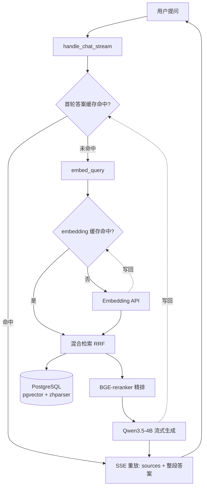
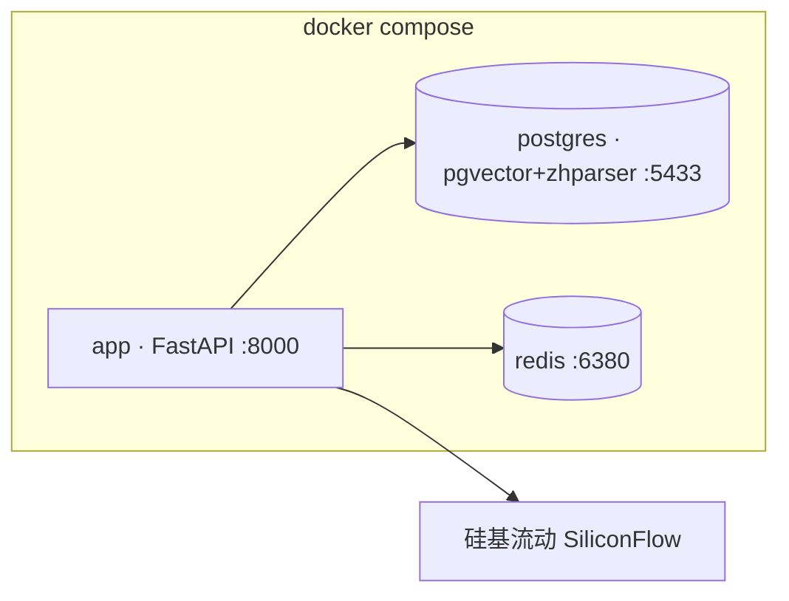

# RAG Service

一个从零手写的生产级 RAG 问答服务,使用 FastAPI + PostgreSQL/pgvector + Redis + 硅基流动(SiliconFlow)。支持文件上传、混合检索、Rerank、引用溯源、多轮对话、流式输出、缓存与可观测性。

## 架构特点

- **混合检索**: pgvector 余弦距离 + tsvector + zhparser 中文分词,RRF 融合
- **三段式 pipeline**: 召回(混合) → 精排(BGE-reranker-v2-m3) → 生成(Qwen/Qwen3.5-4B)
- **引用溯源**: 答案带 `[n]` 标注,sources 数组返回完整 chunk 元数据
- **多轮对话**: 服务端持有历史 + Query Rewriting(消解指代/省略,改写句走检索、原话走生成)
- **流式输出**: SSE 逐 token 推送,前端打字机渲染
- **Redis 缓存**: embedding(纯函数,7 天)+ 首轮答案缓存(1 小时);缓存 best-effort,Redis 故障自动降级不拖垮主流程
- **可观测性**: structlog 结构化日志(trace_id 贯穿)+ Prometheus 指标(请求数 / 延迟 / token / 成本)
- **中文友好**: zhparser 中文分词,embedding 用 bge-m3(1024 维,多语言)

## 技术栈

- FastAPI + SQLAlchemy 2.0 (async, psycopg v3)
- PostgreSQL 16 + pgvector (halfvec) + zhparser
- Redis 7 (redis-py async)
- 硅基流动(SiliconFlow):chat `Qwen/Qwen3.5-4B`(思考模型,`enable_thinking=False`)+ embedding `BAAI/bge-m3`(1024d)
- Rerank `BAAI/bge-reranker-v2-m3`(经硅基流动 `/v1/rerank` API)
- structlog + prometheus-client
- Docker Compose 编排(app + postgres + redis)

## 请求流程



详细分层架构与时序图见 [docs/ARCHITECTURE.md](docs/ARCHITECTURE.md);技术决策与面试考点见 [docs/DECISIONS.md](docs/DECISIONS.md)。

## 服务编排



## 快速开始

依赖: Docker / Docker Compose;(本地开发另需) Python 3.12+。

### 方式 A:全栈一键启动(推荐)

```bash
cp .env.example .env
# 编辑 .env,填 OPENAI_API_KEY / OPENAI_BASE_URL(硅基流动:https://api.siliconflow.cn/v1)
docker compose up -d --build
```

首次构建会编译 zhparser(3-5 分钟)并装依赖。三个服务(app / postgres / redis)起来后:

- API 文档: http://127.0.0.1:8000/docs
- Web UI: http://127.0.0.1:8000/ui/
- 指标: http://127.0.0.1:8000/metrics

> app 容器启动时由 `entrypoint.sh` 自动建表(`python -m scripts.init_db`),无需手动初始化。

### 方式 B:本地开发(只用容器跑 DB + Redis)

```bash
docker compose up -d postgres redis      # 只起依赖服务
python -m venv .venv && source .venv/bin/activate
pip install -r requirements.txt
cp .env.example .env                      # 填硅基流动配置
python -m scripts.init_db                 # 建表
fastapi dev app/main.py                   # 起服务(热重载)
```

> `.env` 里 `DATABASE_URL` / `REDIS_URL` 用宿主机视角(`localhost:5433` / `localhost:6380`);compose 内 app 容器会覆盖成服务名(`postgres:5432` / `redis:6379`)。

## API

| 端点                 | 说明                                              |
| -------------------- | ------------------------------------------------- |
| `POST /upload`       | 上传 txt / md / pdf → 解析 → 分块 → 向量化 → 入库 |
| `POST /query`        | 问答(非流式),返回答案 + 引用源 + conversation_id  |
| `POST /query/stream` | 问答(SSE 流式),帧序列 `sources → token×N → done`  |
| `/conversations`     | 会话 CRUD(创建 / 列表 / 详情 / 删除)              |
| `GET /metrics`       | Prometheus 指标(pull 模型)                        |
| `/ui/`               | 内置极简 Web 界面(三栏:上传 / 对话 / 引用)        |

## 验证脚本(无 pytest,直接跑)

```bash
python -m scripts.test_retrieval     # 检索质量(10 个 golden questions)
python -m scripts.test_redis         # Redis 连通
python -m scripts.test_embed_cache   # embedding 缓存命中 / 降级
python -m scripts.bench_cache        # 答案缓存前后延迟对比
python -m scripts.show_metrics       # 打印指标快照
```
