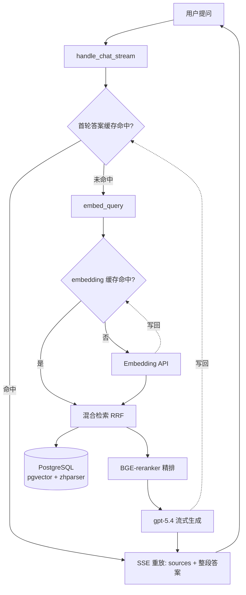
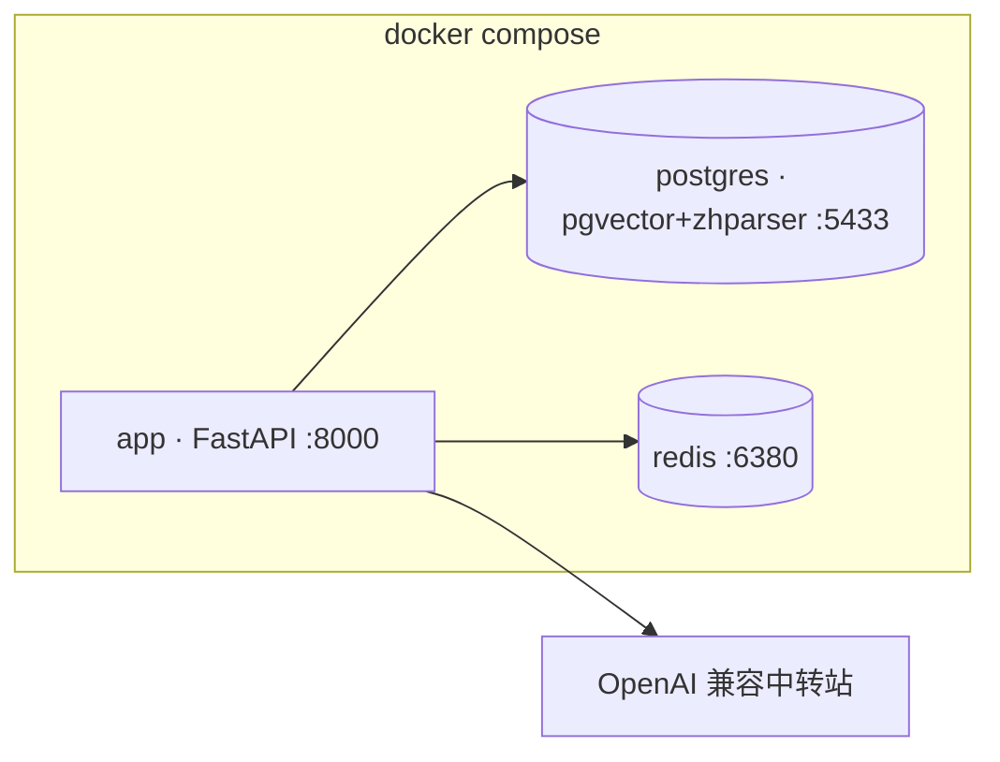

# RAG Service

一个从零手写的生产级 RAG 问答服务,使用 FastAPI + PostgreSQL/pgvector + Redis + OpenAI 兼容中转站。支持文件上传、混合检索、Rerank、引用溯源、多轮对话、流式输出、缓存与可观测性。

## 架构特点

- **混合检索**: pgvector 余弦距离 + tsvector + zhparser 中文分词,RRF 融合
- **三段式 pipeline**: 召回(混合) → 精排(BGE-reranker-v2-m3) → 生成(gpt-5.4)
- **引用溯源**: 答案带 `[n]` 标注,sources 数组返回完整 chunk 元数据
- **多轮对话**: 服务端持有历史 + Query Rewriting(消解指代/省略,改写句走检索、原话走生成)
- **流式输出**: SSE 逐 token 推送,前端打字机渲染
- **Redis 缓存**: embedding(纯函数,7 天)+ 首轮答案缓存(1 小时);缓存 best-effort,Redis 故障自动降级不拖垮主流程
- **可观测性**: structlog 结构化日志(trace_id 贯穿)+ Prometheus 指标(请求数 / 延迟 / token / 成本)
- **中文友好**: zhparser 中文分词,embedding 维度 1536(text-embedding-3-small 原生)

## 技术栈

- FastAPI + SQLAlchemy 2.0 (async, psycopg v3)
- PostgreSQL 16 + pgvector (halfvec) + zhparser
- Redis 7 (redis-py async)
- OpenAI text-embedding-3-small (1536d) + gpt-5.4(均经 OpenAI 兼容中转站)
- BGE-reranker-v2-m3 (sentence-transformers)
- structlog + prometheus-client
- Docker Compose 编排(app + postgres + redis)

## 请求流程



详细分层架构与时序图见 [docs/ARCHITECTURE.md](docs/ARCHITECTURE.md);技术决策与面试考点见 [docs/DECISIONS.md](docs/DECISIONS.md)。

## 服务编排



## 快速开始

依赖: Docker / Docker Compose;(本地开发另需) Python 3.12+。

### 方式 A:全栈一键启动(推荐)

```bash
cp .env.example .env
# 编辑 .env,填 OPENAI_API_KEY / OPENAI_BASE_URL(中转站,通常以 /v1 结尾)
docker compose up -d --build
```

首次构建会编译 zhparser(3-5 分钟)并装依赖。三个服务(app / postgres / redis)起来后:

- API 文档: http://127.0.0.1:8000/docs
- Web UI: http://127.0.0.1:8000/ui/
- 指标: http://127.0.0.1:8000/metrics

> app 容器启动时由 `entrypoint.sh` 自动建表(`python -m scripts.init_db`),无需手动初始化。

### 方式 B:本地开发(只用容器跑 DB + Redis)

```bash
docker compose up -d postgres redis      # 只起依赖服务
python -m venv .venv && source .venv/bin/activate
pip install -r requirements.txt
cp .env.example .env                      # 填中转站配置
python -m scripts.init_db                 # 建表
fastapi dev app/main.py                   # 起服务(热重载)
```

> `.env` 里 `DATABASE_URL` / `REDIS_URL` 用宿主机视角(`localhost:5433` / `localhost:6380`);compose 内 app 容器会覆盖成服务名(`postgres:5432` / `redis:6379`)。

## API

| 端点 | 说明 |
|---|---|
| `POST /upload` | 上传 txt / md / pdf → 解析 → 分块 → 向量化 → 入库 |
| `POST /query` | 问答(非流式),返回答案 + 引用源 + conversation_id |
| `POST /query/stream` | 问答(SSE 流式),帧序列 `sources → token×N → done` |
| `/conversations` | 会话 CRUD(创建 / 列表 / 详情 / 删除) |
| `GET /metrics` | Prometheus 指标(pull 模型) |
| `/ui/` | 内置极简 Web 界面(三栏:上传 / 对话 / 引用) |

## 验证脚本(无 pytest,直接跑)

```bash
python -m scripts.test_retrieval     # 检索质量(10 个 golden questions)
python -m scripts.test_redis         # Redis 连通
python -m scripts.test_embed_cache   # embedding 缓存命中 / 降级
python -m scripts.bench_cache        # 答案缓存前后延迟对比
python -m scripts.show_metrics       # 打印指标快照
```

## 已知限制

- PDF 解析对扫描件(无文本层)无效,需要 OCR
- 答案缓存只对**无历史首轮**安全(带历史非纯函数);失效靠 TTL(1 小时),未做上传文档时精确清缓存
- chat 调用(rewrite / 生成)暂无重试,中转站撞 429 / 断连直接报错
- `ENABLE_RERANK` 是 A/B 开关,当前默认关闭;开启后召回排序质量更好
- `MODEL_PRICES` 是占位单价,成本指标要按中转站实际计费修改才有意义
- 监控只暴露 `/metrics`,未接真实 Prometheus 抓取 + Grafana 看板
- 中转站限流取决于服务商,大文档入库受其约束;chat 长生成偶有断连
- 知识库小于 ~100 chunks 时混合检索的优势不明显

## 后续路线

- 评测体系(Ragas:Context Recall / Faithfulness,Week 13-14)
- LangGraph Agent 化(Week 9-10)
- 前端产品化(Next.js + Vercel AI SDK,Week 11-12)

## For 面试

用户问一个问题，端到端发生了什么？请按时间顺序写出每一步。
为什么 chunks 表的 embedding 列要用 halfvec(1536) 而不是 vector(3072)？
为什么从 Gemini 迁到 OpenAI 兼容中转站？换 embedding 模型为什么必须清库重新入库？
db.flush() 和 db.commit() 的差别是什么？为什么 ingest 服务里要 flush 而不直接 commit？
RAG 的"幻觉"是怎么产生的？我们的 prompt 是怎么约束的？

为什么不只用向量？盲区
为什么不只用关键词？语义
为什么要 RRF？两路量纲不同
为什么还要 Rerank？召回阶段精度有上限
为什么不只用 Rerank？算不动那么多候选

为什么 embedding 能安全缓存而答案缓存要小心？(纯函数 vs 带历史/知识库会变)
为什么答案只缓存无历史首轮？带历史时同一句话在不同对话里语义不同。
缓存挂了会怎样？best-effort 降级成"无缓存",GET/SET 吞掉 RedisError,绝不拖垮主服务。
流式怎么命中缓存？按同一帧协议重放(sources → 整段答案一帧 token → done),前端无感知。

做过一个完整的 RAG service。技术栈是 FastAPI + PostgreSQL/pgvector,LLM 走 OpenAI 兼容中转站(chat gpt-5.4 + embedding text-embedding-3-small)。
检索是三段式:召回用 pgvector 余弦距离 + zhparser 中文分词的 tsvector 混合检索,RRF 融合(因为两路分数量纲不同);精排用 BGE-reranker-v2-m3 cross-encoder 对 top 20 重排;生成用 gpt-5.4,prompt 强约束基于 context 回答并要求 [n] 引用标注。
几个工程细节:embedding 维度选 1536(text-embedding-3-small 原生,正好在 pgvector HNSW 2000 维上限内);PDF 解析用 PyMuPDF 加启发式去重复页眉页脚;限流用 tenacity 退避 + 主动节流处理;Redis 缓存 embedding 与首轮答案,缓存 best-effort 降级;structlog + Prometheus 做日志与指标(token / 延迟 / 成本)。还做过一次 provider 迁移(Gemini 原生 → OpenAI 中转站),踩过"换 embedding 模型必须清库重灌"的坑。
