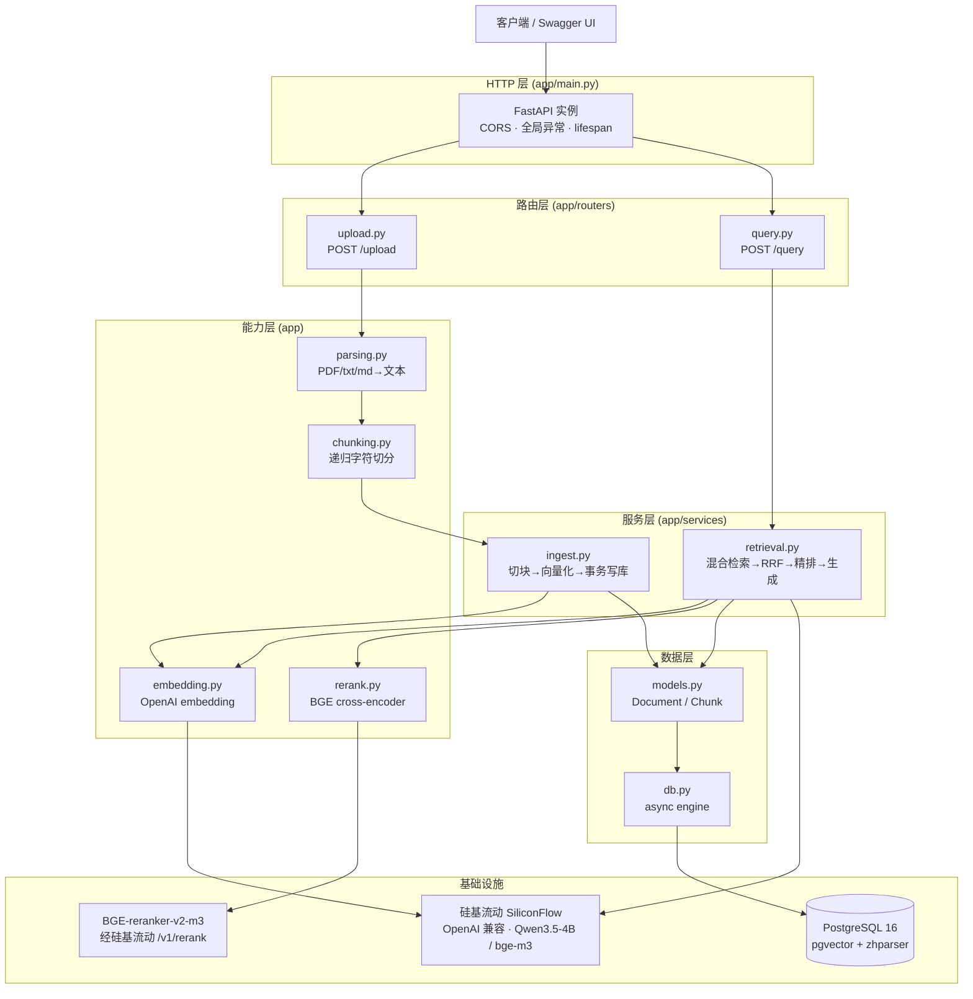
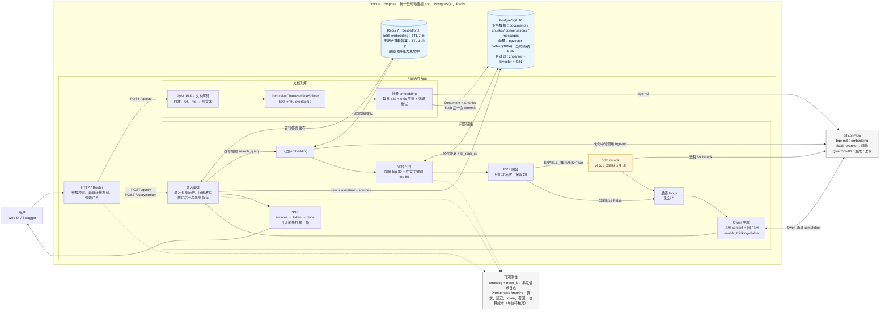
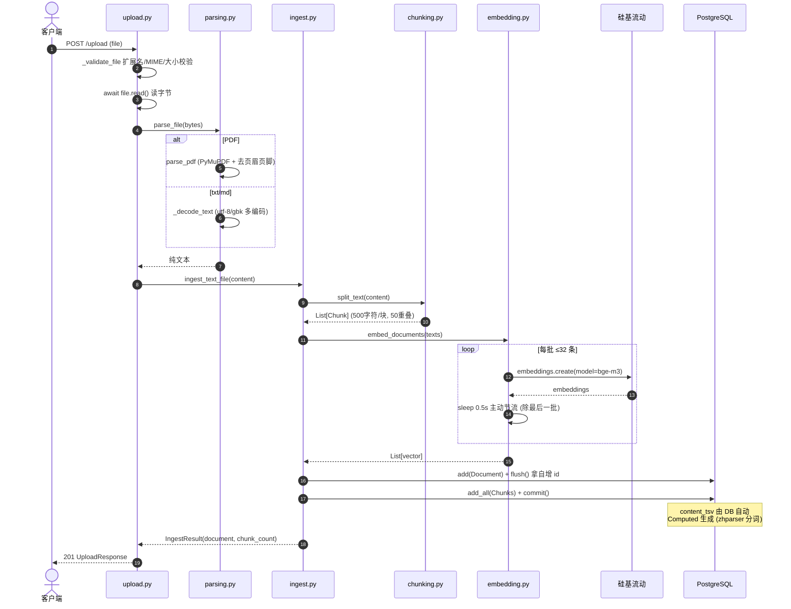
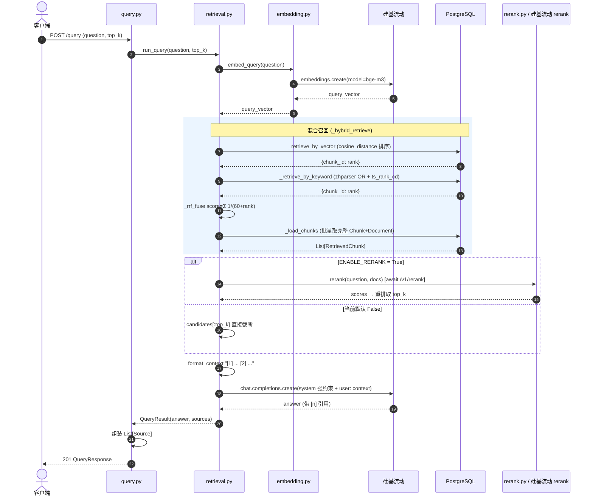
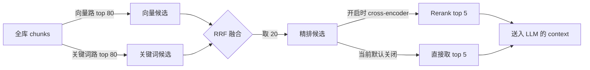

# 架构图 & 时序图

> 配合 `INTERVIEW.md` 一起看。所有图用 Mermaid 编写,GitHub / VSCode 预览可直接渲染。

## 1. 分层架构图

## 2. 技术方案作用图（复习版）

这张图按真实请求链路组织。方框写“做什么”，连线写“为什么需要这项技术”；虚线表示日志和指标，不参与业务数据处理。

读图时重点记住：

- PostgreSQL 不只是存数据，还同时负责向量检索和中文全文检索。
- Redis 只减少重复调用，坏了可以绕过，不能拖垮主链路。
- SiliconFlow 提供三个不同模型能力：embedding、rerank、生成/改写。
- rerank 代码已经接好，但当前默认关闭；embedding 也还没有 HNSW 索引。
- structlog 和 Prometheus 负责发现问题，不参与答案生成。

## 3. 文档入库时序图 (POST /upload)

## 4. 提问检索时序图 (POST /query)

## 5. 三段式检索漏斗 (数据量收敛)

> 数字来源:`RERANK_CANDIDATES=20`,`CANDIDATES_MULTIPLIER=4` → 每路召回 20×4=80,RRF 后取 20。`ENABLE_RERANK=True` 时精排后取 `top_k`;当前默认是 `False`,直接从 RRF 结果取 `top_k`(默认 5)。
