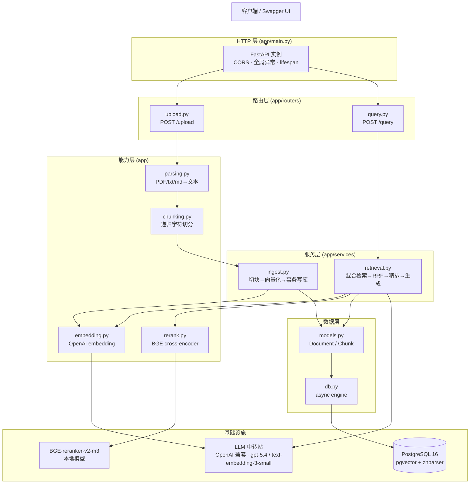
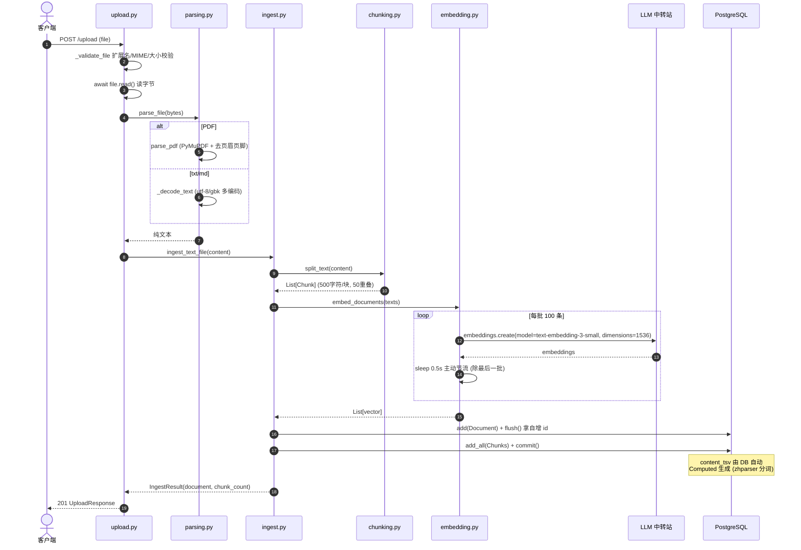
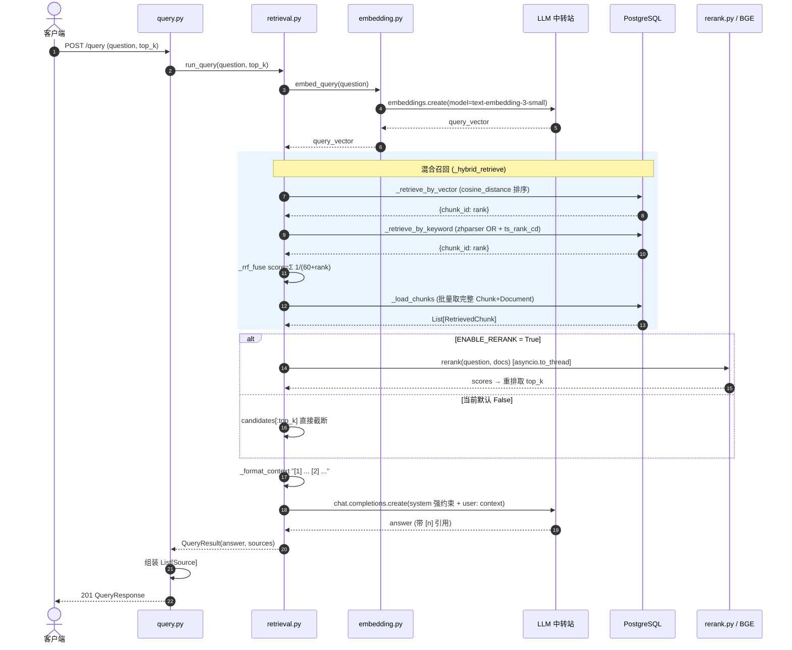
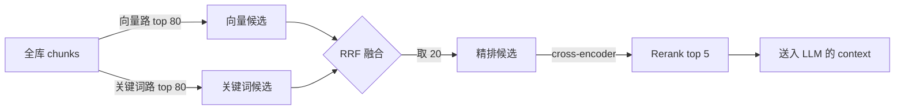

# 架构图 & 时序图

> 配合 `INTERVIEW.md` 一起看。所有图用 Mermaid 编写,GitHub / VSCode 预览可直接渲染。

## 1. 分层架构图

## 2. 文档入库时序图 (POST /upload)

## 3. 提问检索时序图 (POST /query)

## 4. 三段式检索漏斗 (数据量收敛)

> 数字来源:`RERANK_CANDIDATES=20`,`CANDIDATES_MULTIPLIER=4` → 每路召回 20×4=80,RRF 后取 20,精排后取 `top_k`(默认 5)。
