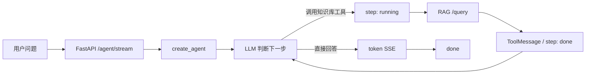

# LangGraph Agent 面试复习

> 本文以当前项目代码为准，不再按学习 Step 逐条追加。复习时先看“30 秒介绍”和最终链路，再按核心问题展开。

## 30 秒介绍

这是一个从 LangGraph 基础机制逐步走到 Agent 服务化的练习项目。

前半段用 `StateGraph` 手写了状态更新、条件分支和 `model → tools → model` 循环；中间补上 Checkpointer、Human-in-the-loop、重试、模型 Fallback 和运行日志；后半段把 RAG 服务封装成工具，继续实现流式输出、多 Agent 路由，以及供前端消费的 FastAPI + SSE 接口。

项目最核心的结论是：

> LangGraph 负责保存状态和控制流程；LLM 只负责在当前上下文中做决定。工具真正怎么执行、状态怎么持久化、失败怎么恢复，都由应用层负责。

当前项目已经覆盖这些机制，但最终的 `15_agent_server.py` 仍是单轮、单 Agent 的演示服务，不等于前面所有能力都已经接入生产链路。

## 最终请求是怎么跑的



对应代码：

1. [`11_demo_rag_agent.py`](../11_demo_rag_agent.py) 把 RAG `/query` 封装为 `search_knowledge_base` 工具。
2. [`14_inspect_stream.py`](../14_inspect_stream.py) 先用真实输出确认 `updates` 和 `messages` 两种流的数据形状。
3. [`15_agent_server.py`](../15_agent_server.py) 再把 LangGraph 事件翻译成 `step`、`token`、`done`、`error` 四类 SSE 帧。

工具事件和 token 可能随 Agent 循环交错出现，不能依赖一套绝对固定的帧顺序；能确定的是同一次工具调用用 `tool_call_id` 配对，整个流正常结束时发送 `done`。

## 项目代码地图

| 阶段       | 文件                                         | 解决的问题                                                |
| ---------- | -------------------------------------------- | --------------------------------------------------------- |
| 图与状态   | `01_graph.py`～`03_chatbot.py`               | State、节点、边、Reducer、条件路由、多轮消息              |
| Agent 核心 | `04_tool_agent.py`～`05_agent_loop.py`       | Tool Calling、`ToolNode`、手写 Agent Loop、`create_agent` |
| 运行保障   | `06_checkpoint.py`～`10_log_visual.py`       | 状态持久化、HITL、Retry、Fallback、日志与图可视化         |
| 业务集成   | `11_demo_rag_agent.py`～`15_agent_server.py` | RAG-as-tool、Streaming、多 Agent、SSE 服务                |

---

## 一、LangGraph 到底解决什么问题

一句话回答：

> LangGraph 是一个有状态的流程编排框架，适合表达分支、循环、暂停和恢复；它不负责让模型变聪明。

四个核心概念：

| 概念    | 作用                                   | 项目示例                                   |
| ------- | -------------------------------------- | ------------------------------------------ |
| State   | 保存图运行期间共享的数据               | `MyState`、`MessagesState`                 |
| Node    | 读取 State，执行一步工作，返回局部更新 | `node_chat`、`node_llm`                    |
| Edge    | 决定节点之间如何流转                   | 固定边、条件边、回边                       |
| Reducer | 决定新旧字段如何合并                   | `operator.add`、`MessagesState` 的消息追加 |

需要讲清三点：

- 节点只返回要更新的字段，框架再把局部结果合并进 State。
- 普通字段默认被新值覆盖；需要累计时必须声明 Reducer。
- 路由函数只读取 State 并返回下一条路径，不应该在里面重复调 LLM 或产生副作用。

[`01_graph.py`](../01_graph.py) 演示列表通过 Reducer 累加；[`02_conditional.py`](../02_conditional.py) 演示节点先把分类写入 State，再由条件边选择分支。

## 二、多轮对话和 Agent 有什么区别

|                | 普通多轮对话      | Agent                               |
| -------------- | ----------------- | ----------------------------------- |
| 流程           | 用户 → LLM → 答案 | LLM → 工具 → LLM，可循环多次        |
| 下一步由谁决定 | 应用代码预先写死  | LLM 通过 `tool_calls` 选择          |
| 外部能力       | 通常没有          | 可以查库、调用 API、执行业务操作    |
| 是否自动记忆   | 否                | 也不会，仍需传历史或接 Checkpointer |

LLM API 本身没有这个项目上一轮的记忆。[`03_chatbot.py`](../03_chatbot.py) 通过“带历史”和“不带历史”两次调用证明：所谓多轮记忆，本质是应用层再次传入历史消息。

Agent 的分水岭不是“能多聊几轮”，而是 LLM 能根据任务决定是否调用工具、调用哪个工具，以及拿到结果后是否继续。

## 三、Tool Calling 和 Agent Loop 怎么工作

完整往返是：

```text
HumanMessage
  → AIMessage(tool_calls)
  → 应用层执行工具
  → ToolMessage
  → AIMessage(最终答案或下一次 tool_calls)
```

LLM 只生成工具名和参数，不会亲自执行 Python 函数。`ToolNode` 执行工具，再把结果包装成 `ToolMessage` 放回消息列表。

手写循环只需要两个节点：

- `model`：调用绑定了工具的 LLM。
- `tools`：执行 `tool_calls`。

`model` 后面的条件边检查最后一条 `AIMessage`：

- 有 `tool_calls`：进入 `tools`，执行后回到 `model`。
- 没有 `tool_calls`：说明模型已经给出最终答案，结束图。

[`05_agent_loop.py`](../05_agent_loop.py) 同时保留了手写版本和 `create_agent` 版本。工具的函数名、docstring 和参数类型会进入工具 Schema，直接影响模型是否会选对工具、参数是否正确。

## 四、LangChain 的 `create_agent` 和 LangGraph 怎么选

两者不是竞争关系：

- `create_agent` 是高层封装，适合标准的 `model ↔ tools` 循环。
- `StateGraph` 是底层编排，适合自定义状态、路由、审批、多 Agent 和特殊异常流程。

本项目的选择很典型：

- [`05_agent_loop.py`](../05_agent_loop.py)、[`11_demo_rag_agent.py`](../11_demo_rag_agent.py) 用 `create_agent` 快速搭标准 Agent。
- [`07_hitl.py`](../07_hitl.py) 用手写图插入审批节点。
- [`13_multi_agent_by_claude.py`](../13_multi_agent_by_claude.py) 用手写图让 Supervisor 路由到不同 Agent。

面试时可以这样回答：先用 `create_agent` 完成常规需求；只有需要控制中间状态和流程时，才下沉到 `StateGraph`，避免过度编排。

## 五、状态持久化和多会话记忆怎么做

Checkpointer 保存的是图的 State，`thread_id` 用来隔离不同会话。

[`06_checkpoint.py`](../06_checkpoint.py) 演示了两种后端：

- `InMemorySaver`：进程内有效，重启丢失，适合测试。
- `SqliteSaver`：写入 SQLite，进程重启后仍可恢复，适合本地演示。

同一个 `thread_id` 再次调用时，只传新消息也能接上历史；换一个 `thread_id` 就是独立会话。生产环境通常需要共享的持久化后端，避免请求落到另一实例或进程重启后找不到状态。

要注意：[`15_agent_server.py`](../15_agent_server.py) 没有配置 Checkpointer，也没有接收 `thread_id`，所以当前对外 Agent 接口仍是单轮的。

## 六、Human-in-the-loop 为什么离不开 Checkpointer

[`07_hitl.py`](../07_hitl.py) 的流程是：

```text
执行到 interrupt()
  → 保存当前 State 并暂停
  → 把审批问题返回给人
  → 之后用同一 thread_id + Command(resume=...) 恢复
```

这里的“暂停”不应该理解成进程一直阻塞等待。生产做法通常是第一次请求保存状态后结束，用户审批时再发第二次请求恢复。

恢复时，包含 `interrupt()` 的节点会从头重新执行，因此 `interrupt()` 之前不能放不可重复的副作用。审批和真正的删除、扣款、发信等操作应拆成不同节点，并为副作用设计幂等保护。

当前示例使用 `InMemorySaver`，也没有把开始和恢复做成 HTTP 接口，所以它验证了机制，但还不是可跨进程恢复的审批服务。

## 七、Retry 和 Fallback 有什么区别

|          | Retry                    | Fallback                   |
| -------- | ------------------------ | -------------------------- |
| 做法     | 同一个节点再执行一次     | 换另一个模型或 Runnable    |
| 适合     | 超时、连接失败等瞬时错误 | 主模型整体不可用或需要降级 |
| 项目实现 | `RetryPolicy`            | `with_fallbacks`           |

[`08_retry.py`](../08_retry.py) 对 `ConnectionError`、`TimeoutError` 最多执行 4 次；`max_attempts` 表示总执行次数，不是失败后额外重试 4 次。

[`09_fallback.py`](../09_fallback.py) 故意使用错误模型名，让调用转到备用模型。它还暴露了一个工程问题：`with_fallbacks` 返回的是通用 Runnable，和 `create_agent` 声明的模型类型不完全一致，当前代码只对这处类型检查做了精确忽略。

Retry 和 HITL 恢复都会重新执行节点，因此共同要求是：节点尽量幂等，外部写操作要有幂等键或去重机制。

当前 `15_agent_server.py` 没有接入前面演示的 Retry 和 Fallback。

## 八、流式输出和可观测性怎么做

本项目实际使用了两种流：

| `stream_mode` | 粒度                 | 用途                   |
| ------------- | -------------------- | ---------------------- |
| `updates`     | 节点完成后的局部更新 | 识别工具调用和工具结果 |
| `messages`    | 消息块 / token       | 实现答案的打字机输出   |

[`12_streaming_by_claude.py`](../12_streaming_by_claude.py) 对比了两种粒度；[`14_inspect_stream.py`](../14_inspect_stream.py) 同时开启两种模式，确认多模式输出是 `(mode, payload)`。

`15_agent_server.py` 的转换规则是：

- `AIMessage.tool_calls` → `step/running`。
- `ToolMessage` → `step/done`，用 `tool_call_id` 和前一帧配对。
- 有内容的 `AIMessageChunk` → `token`。
- 图正常结束 → `done`。
- 流中异常 → `error`。

这里必须过滤 `AIMessageChunk`。因为 `messages` 模式也可能出现工具结果，如果把所有消息内容都当 token，整段 `ToolMessage` 会被错误地显示成最终答案。

SSE 响应一旦开始发送，就不能再修改 HTTP 状态码，所以流中错误只能作为 `error` 数据帧通知前端。

可观测性方面，[`10_log_visual.py`](../10_log_visual.py) 用装饰器记录函数节点的输入、局部输出和耗时，但包不到 `ToolNode` 这类 Runnable；图自身的 `stream` 能覆盖这些预构建节点。当前项目还没有接入统一的生产级 tracing。

## 九、为什么把 RAG 做成工具

传统 RAG 是固定流水线：每个问题都检索，再生成答案。Agent 把 RAG 变成工具后，由 LLM 决定：

- 通用问题直接回答，不查知识库。
- 技术问题调用 `search_knowledge_base`，读取检索结果后再回答。

这就是从“必走检索”变成“按需检索”。

当前实现也有两个明确代价：

1. 工具调用的是同时包含检索和生成的 `/query`，但 Agent 只取 `sources`、丢弃 RAG 已生成的 `answer`，存在一次多余生成。更合适的生产接口应只负责检索。
2. `15_agent_server.py` 把结构化 `sources` 拼成纯文本，丢失了 `id`、`chunk_id`、`similarity` 等字段，因此 Agent 模式目前不能提供 RAG 模式那样的引用溯源。

## 十、多 Agent 是怎么组织的

[`13_multi_agent_by_claude.py`](../13_multi_agent_by_claude.py) 使用 Supervisor 模式：

1. Supervisor 读取用户问题，用 LLM 判断走 `tech` 还是 `general`。
2. 判断结果写入 `state["next"]`。
3. 条件边把请求路由到 `tech_agent` 或 `general_agent`。
4. 专家 Agent 完成自己的内部 `model ↔ tools` 循环后结束。

一个编译好的 Agent 本身也是可执行图，只要输入、输出 State 形状兼容，就能作为大图的一个节点。

当前实现只是单次分类和单路由，没有 Agent 之间的多轮协作、任务交接和结果汇总；它也没有接入 `15_agent_server.py`。

---

## 当前实现边界

| 能力                      | 示例代码         | 对外 SSE 服务是否已接入 |
| ------------------------- | ---------------- | ----------------------- |
| Tool Calling / Agent Loop | `04`、`05`       | 是                      |
| RAG-as-tool               | `11`             | 是                      |
| token 与工具步骤流        | `12`、`14`、`15` | 是                      |
| Checkpointer / 多轮记忆   | `06`             | 否                      |
| Human-in-the-loop         | `07`             | 否                      |
| Retry / 模型 Fallback     | `08`、`09`       | 否                      |
| 手写节点日志              | `10`             | 否                      |
| 多 Agent 路由             | `13`             | 否                      |
| 结构化引用溯源            | 无               | 否，当前被拍平成文本    |

因此，介绍项目时不要说“已经做成完整生产 Agent 平台”。更准确的说法是：

> 我用一组可独立运行的示例验证了 LangGraph 的核心和工程机制，并把其中的单 Agent、RAG 工具调用和流事件转换接成了可供前端消费的 SSE 服务；持久化、审批、容错和多 Agent 仍停留在独立示例，尚未整合进最终服务。

## 最后记住 5 句话

1. LangGraph 管的是 State 和流程，LLM 只负责基于上下文做决策。
2. **Agent 的核心是 `model → tools → model` 循环，结束条件是模型不再返回 `tool_calls`。**
3. 多轮记忆依赖历史消息或 Checkpointer；HITL 依赖“持久化状态 + 两次独立请求恢复”。
4. 当前完整链路是 `FastAPI → Agent → RAG 工具 → LangGraph 双模式流 → SSE`。
5. 项目已验证关键机制，但最终服务尚未整合持久化、HITL、容错、多 Agent 和结构化引用。
