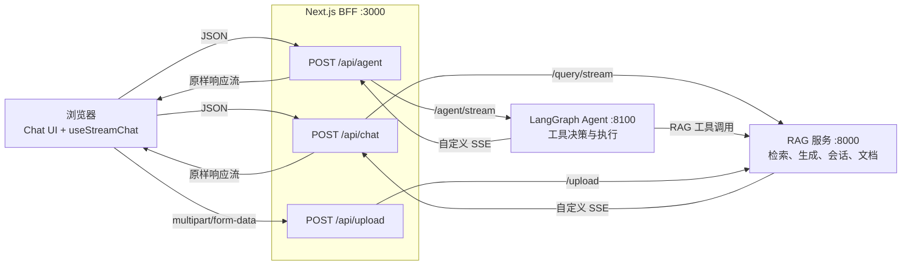

# 前端流式问答架构（Week 11–12）

> 这份文档用于理解实现和准备面试，内容以当前代码为准。
> 建议先读第 1–4 节掌握主链路，再按需看 RAG、Agent、引用和异常处理。
> 项目路线、后端完整契约与逐日计划见 [PLAN.md](../PLAN.md)。

## 1. 核心结论

这是一个基于 Next.js App Router 的 RAG / Agent 聊天前端：

- Next.js Route Handler 充当薄 BFF，把浏览器请求转发给 Python 后端。
- RAG 与 Agent 后端都返回自定义 SSE，BFF 不翻译业务帧，只透传响应流。
- 浏览器用自写的 `useStreamChat`（`fetch` + `ReadableStream`）读取 SSE。
- reducer 把逐帧事件累积成一条扁平的 `ChatMessage`，React 再按字段渲染正文、来源和工具步骤。

最重要的三项设计如下：

| 设计 | 当前实现 | 直接收益 |
|---|---|---|
| 薄 BFF | `/api/chat`、`/api/agent`、`/api/upload` | 后端地址和请求约束集中在服务端，浏览器只访问 `/api/*` |
| 通用流式管道 | `useStreamChat` + `parseSSE` | RAG / Agent 共用读取、停止、重试和状态管理 |
| 扁平消息模型 | `text`、`sources`、`toolSteps`、`conversationId` | reducer 负责协议适配，组件只消费可渲染字段 |

主要技术栈：Next.js 16、React 19、TypeScript 5、Tailwind CSS 4、`react-markdown`、`remark-gfm`、`rehype-highlight`。

## 2. 系统边界与请求路径



三条实际调用链：

```text
RAG：   浏览器 → /api/chat   → RAG :8000 /query/stream
Agent： 浏览器 → /api/agent  → Agent :8100 /agent/stream → RAG 工具
上传：  浏览器 → /api/upload → RAG :8000 /upload
```

### 2.1 BFF 当前负责什么

| Route Handler | 职责 |
|---|---|
| `/api/chat` | 校验问题；固定 `top_k=5`；转发可选 `conversation_id`；透传 RAG SSE；映射开流前错误 |
| `/api/agent` | 校验问题；转发 Agent 请求；透传 Agent SSE；映射开流前错误 |
| `/api/upload` | 接收文件并重新封装为 multipart；回传 RAG 的状态码、响应体和内容类型 |

后端地址来自服务端环境变量 `RAG_API_BASE` 和 `AGENT_API_BASE`，没有通过 `NEXT_PUBLIC_*` 暴露给浏览器。

BFF 目前只是统一入口，不等于完整的安全层：项目尚未实现登录、鉴权、限流或用户隔离。

## 3. 核心模型：事件流如何变成一条消息

后端返回的是“刚发生了什么”，组件需要的是“现在该渲染什么”。reducer 负责把前者累积成后者。

### 3.1 两种后端帧

| 模式 | 帧 | 关键字段 | 含义 |
|---|---|---|---|
| RAG | `sources` | `sources` | 本轮检索来源 |
| RAG | `token` | `text` | 答案增量 |
| RAG | `done` | `conversation_id` | 流结束，并返回多轮会话 ID |
| Agent | `token` | `content` | 答案增量，字段名与 RAG 不同 |
| Agent | `step` | `id`、`status`、`input/output` | 工具开始或完成 |
| Agent | `done` | 无额外字段 | 流结束 |
| 两者 | `error` | `message` | 开流后的业务错误 |

RAG 的正常顺序是 `sources → token × N → done`。Agent 客户端不依赖固定数量，只按帧类型处理 `step`、`token` 和 `done`。

### 3.2 前端消息模型

```ts
interface ChatMessage {
  id: string;
  role: "user" | "assistant";
  text: string;
  sources?: Source[];
  toolSteps?: Array<{ id: string; data: ToolStepData }>;
  conversationId?: string;
}
```

映射规则：

| 收到的帧 | reducer 操作 | 渲染或后续用途 |
|---|---|---|
| RAG `sources` | `draft.sources = frame.sources` | 引用侧栏 |
| RAG `token` | `draft.text += strip(frame.text)` | Markdown 正文 |
| RAG `done` | 写入 `draft.conversationId` | 下一轮请求继续同一会话 |
| Agent `token` | `draft.text += strip(frame.content)` | Markdown 正文 |
| Agent `step: running` | 新增同 ID 的工具步骤 | 显示“正在调用” |
| Agent `step: done` | 按 ID 替换对应步骤并补上输出 | 显示“已调用” |
| `error` | 抛出异常 | 交给 hook 切换到错误状态 |

例如，RAG 帧：

```text
sources([1], [2], [3])
token("RAG 会先检索")
token("[2]，再生成答案。")
done("c-abc")
```

最终累积成：

```ts
{
  role: "assistant",
  text: "RAG 会先检索[2]，再生成答案。",
  sources: [/* 3 条来源 */],
  conversationId: "c-abc",
}
```

扁平模型让渲染简单，但也做了一个明确取舍：Agent 的工具步骤与文本分别存储，界面固定显示“工具时间线在上、合并后的正文在下”，不保留两者到达时的逐帧交错顺序。

## 4. 通用流式管道

### 4.1 前后端流式技术选型

结论：Python 后端使用 **FastAPI / Starlette `StreamingResponse` + SSE** 推流；浏览器使用 **`fetch` + `ReadableStream` + `TextDecoder`** 接收。这里没有使用 WebSocket。

| 环节 | 使用技术 | 作用 |
|---|---|---|
| RAG 后端 | FastAPI / Starlette `StreamingResponse` | 返回持续输出的 HTTP 响应流 |
| Agent 后端 | LangGraph `astream` | 产生 token 和工具执行事件 |
| 数据生成 | Python `async generator` + `yield` | 逐帧生成 `sources`、`token`、`step`、`done` 等事件 |
| 传输协议 | SSE（`text/event-stream`） | 把每帧编码为 `data: JSON\n\n` |
| Next.js 中转 | Route Handler + 服务端 `fetch` + Web Streams API | 将 Python 后端的 `upstream.body` 原样转给浏览器 |
| 浏览器接收 | Fetch API + `ReadableStream<Uint8Array>` | 持续读取响应字节 |
| 字节解码 | `TextDecoder({ stream: true })` | 正确处理跨 chunk 的 UTF-8 字符 |
| 事件解析 | buffer + `\n\n` 切帧 + `JSON.parse` | 把网络字节恢复成完整业务帧 |
| React 更新 | `useStreamChat` + reducer + `setMessages` | 累积正文、来源和工具步骤并刷新界面 |

完整技术链路：

```text
FastAPI StreamingResponse(async generator)
  → SSE
  → Next.js Response(upstream.body)
  → fetch response.body
  → ReadableStream + TextDecoder
  → parseSSE
  → reducer
  → setMessages
```

没有使用原生 `EventSource`，因为当前接口需要通过 POST 发送 JSON 请求体，同时需要使用 `AbortController` 停止生成；`fetch + ReadableStream` 能同时满足这两个要求。

`useStreamChat` 不理解 RAG 或 Agent 的业务语义，只负责一次流式请求的生命周期：

1. `send` 追加一条 user 消息。
2. `stream` 再追加一条空的 assistant 草稿，并把状态设为 `streaming`。
3. `fetch` 向 `/api/chat` 或 `/api/agent` 发起 POST 请求。
4. `parseSSE` 从响应体逐帧读取 JSON。
5. 当前模式的 reducer 修改草稿。
6. 每帧复制最新草稿并 `setMessages`，触发流式渲染。
7. 正常结束后回到 `ready`；异常进入 `error`；用户停止则回到 `ready`。

核心过程可以压缩为：

```ts
for await (const frame of parseSSE(response.body)) {
  reduce(frame, draft, strip.push);
  commit(replaceDraft(messages, { ...draft }));
}
```

### 4.2 SSE 如何处理拆包

网络 chunk 不等于 SSE 事件，一条 JSON 可能跨多个 chunk。`parseSSE` 因此：

- 用 `TextDecoder.decode(value, { stream: true })` 正确拼接跨 chunk 的 UTF-8 字符。
- 把文本保存在 `buffer`，按后端约定的 `\n\n` 切分事件。
- 合并事件内的多行 `data:`，再执行 `JSON.parse`。
- 流结束时处理剩余 buffer，并在 `finally` 中释放 reader。

当前策略会跳过无法解析的 JSON 帧，而不是让整条流立即失败；这是容错，也是可观测性上的限制。

### 4.3 `<think>` 为什么需要状态机

`<think>` 或 `</think>` 可能被拆在两个 token 中，单次 `replace` 无法可靠处理。`createThinkStripper` 用三个要素跨 token 记忆状态：

- `text` 模式：输出正文，遇到 `<think>` 后切换状态。
- `think` 模式：丢弃内容，遇到 `</think>` 后恢复输出。
- `carry`：暂存可能是标签前缀的尾部，例如 `</thi`，等下一段拼接后再判断。

流结束时，只有 `text` 模式下的剩余内容会被补到正文。

### 4.4 对话状态

| 状态或操作 | 实现 |
|---|---|
| `ready / streaming / error` | `ChatStatus` |
| 停止 | `AbortController.abort()`；客户端主动停止不记为错误 |
| 重试 | 回退到最后一条 user 消息，用原请求参数重新生成 |
| 重置 | 终止当前请求，清空消息和错误 |
| 防止异步闭包读旧值 | `messagesRef` 与 React state 通过统一的 `commit` 同步更新 |

## 5. RAG 模式

### 5.1 端到端链路

```text
Chat.send
  → 从最近一条 assistant 消息读取 conversationId
  → useStreamChat.send(question, { conversation_id? })
  → POST /api/chat
  → BFF 转发 /query/stream，并补上 top_k=5
  → sources / token / done
  → ragReduce 累积 sources、text、conversationId
  → MessageItem 渲染答案和来源入口
```

`conversation_id` 只存在于 RAG 模式。它由 `done` 帧写回当前 assistant 消息，下一轮再从最近一条 assistant 消息读取。刷新页面或切换模式后，前端不会恢复这段会话。

### 5.2 引用溯源

答案正文中的 `[n]` 与 `sources[].id` 由后端对齐，前端只负责把有效编号变成可交互引用：

```text
答案中的 [2]
  → rehype-citations 把有效编号改成 <cite data-ref="2">
  → Markdown 的 CiteRef 触发 onCite(2)
  → MessageItem 把“本条消息的 sources + 编号 2”交给 Chat
  → Chat 更新全局 activeSources
  → SourcesPanel 展开、高亮并滚动到来源 2
```

实现边界：

- 只转换当前消息 `sources` 中存在的编号。
- 跳过 `code` 和 `pre`，代码里的 `[2]` 不会被识别为引用。
- 来源列表属于具体消息；侧边栏全局只有一个，因此共享状态放在共同父组件 `Chat`。
- 高亮和展开状态从 props 派生，`useEffect` 只执行 `scrollIntoView`。

## 6. Agent 模式

Agent 模式复用同一个 `useStreamChat`，只替换 endpoint 和 reducer：

```text
/api/agent + agentReduce
  → step(running)：新增工具步骤
  → step(done)：按相同 id 补齐 output，并切换为 done
  → token(content)：追加答案正文
  → done：结束
```

与 RAG 的关键差异：

| 对比项 | RAG | Agent |
|---|---|---|
| token 字段 | `text` | `content` |
| 来源 | 有 `sources` 帧 | 无结构化来源帧 |
| 多轮 ID | `done.conversation_id` | 无 |
| 工具步骤 | 无 | `step` 帧，running / done 用同一 ID 配对 |

`ToolTimeline` 根据步骤状态展示工具名、入参和返回值。`MessageItem` 固定先渲染工具时间线，再渲染合并后的 Markdown 正文。

## 7. 渲染与状态归属

| 层 | 主要职责 |
|---|---|
| `Chat` | 模式、输入、上传、全局来源侧栏、自动滚动；选择 endpoint 和 reducer |
| `useStreamChat` | 消息、流式状态、请求取消、重试和重置 |
| `MessageItem` | 单条消息、工具时间线、正文、来源入口和本地反馈 |
| `Markdown` | GFM、代码高亮、有效引用编号转换 |
| `SourcesPanel` | 桌面常驻侧栏、移动端抽屉、来源展开与定位 |
| `ToolTimeline` | Agent 工具步骤的 running / done 展示 |

Markdown 渲染链：

```text
ChatMessage.text
  → MessageContent
  → ReactMarkdown
  → remark-gfm
  → rehype-citations
  → rehype-highlight
  → React 元素
```

流式阶段每个事件都会更新消息，正在生成的 Markdown 会被重复解析。当前用 `memo`、稳定的 `sources` / `validIds` / `onCite` 引用以及轻量同步高亮减少无关重渲染；尚未实现批量提交或节流。

## 8. 上传、错误与交互状态

### 8.1 文件上传

- 客户端先校验扩展名和 30 MB 上限。
- 支持 `.txt`、`.md`、`.markdown`、`.pdf`。
- 使用 `XMLHttpRequest`，因为 `xhr.upload.onprogress` 可以提供上传进度。
- `/api/upload` 把文件转发给 RAG `/upload`。
- 成功后显示文件名和 `chunk_count`，文档进入同一个 RAG 知识库。

### 8.2 错误分层

| 阶段 | 当前处理 |
|---|---|
| 空问题 | BFF 返回 400 |
| chat / agent 无法连接后端 | Route Handler 捕获网络异常并返回 502 |
| 后端在开流前返回 4xx / 5xx | BFF 回传状态码和响应体；hook 进入 `error` |
| 后端开流后失败 | 后端发送 `error` 帧；reducer 抛出；hook 进入 `error` |
| 用户点击停止 | 中止浏览器请求，保留已收到内容，不显示错误 |
| 上传后端返回错误 | `/api/upload` 回传后端状态码和响应体 |

错误 UI 统一显示错误文案和“重试”。重试会丢弃失败的 assistant 草稿，但保留对应 user 消息。

## 9. 文件地图

```text
src/
├─ app/
│  ├─ page.tsx
│  ├─ layout.tsx
│  ├─ globals.css
│  └─ api/
│     ├─ chat/route.ts         RAG SSE 透传
│     ├─ agent/route.ts        Agent SSE 透传
│     └─ upload/route.ts       文件上传转发
├─ lib/
│  ├─ types.ts                 Source、后端帧、ChatMessage
│  ├─ sse.ts                   SSE 拆包与 JSON 解析
│  ├─ think.ts                 <think> 跨 chunk 剥离
│  ├─ useStreamChat.ts         通用流式请求与对话状态
│  ├─ reducers.ts              RAG / Agent 帧到消息字段的映射
│  ├─ rehype-citations.ts      [n] 到可点击引用节点
│  └─ upload.ts                客户端校验与 XHR 上传
└─ components/chat/
   ├─ Chat.tsx                 页面编排与共享状态
   ├─ MessageItem.tsx          单条消息
   ├─ MessageContent.tsx       Markdown 薄封装
   ├─ Markdown.tsx             Markdown、GFM、高亮、引用组件
   ├─ SourcesPanel.tsx         来源侧栏
   ├─ ToolTimeline.tsx         工具时间线
   └─ message-utils.ts         从消息读取视图数据
```

真正决定架构行为的四个文件是：

1. `app/api/{chat,agent}/route.ts`：BFF 是否翻译或透传协议。
2. `lib/sse.ts`：字节流如何还原成事件。
3. `lib/useStreamChat.ts`：一次流式请求的生命周期。
4. `lib/reducers.ts`：事件如何变成可渲染消息。

## 10. 当前边界与剩余风险

| 当前边界 | 影响 |
|---|---|
| 无登录、鉴权、限流和用户体系 | 适合作品演示，不适合直接作为多租户生产系统 |
| `top_k=5` 固定在 `/api/chat` | UI 无法按请求调整检索数量 |
| 消息只保存在 React state | 刷新页面丢失；没有会话列表与恢复 |
| 切换 RAG / Agent 会调用 `reset` | 两种模式的前端历史都不会保留 |
| Agent 采用扁平字段 | 工具步骤和正文的真实交错顺序被规范化 |
| 后端帧没有运行时 schema 校验 | 类型通过 `unknown → Reduce` 断言跨边界，协议漂移只能在运行时暴露 |
| 无法解析的 SSE JSON 会被静默跳过 | 单帧损坏不会终止整流，但问题不易发现 |
| 每帧都 `setMessages` 并解析 Markdown | 长回答可能需要约 50 ms 的批量刷新或节流 |
| `/api/upload` 没有单独捕获连接异常 | RAG 服务不可达时，上传错误不如 chat / agent 的 502 文案稳定 |
| 反馈按钮只保存组件本地状态 | 没有提交到后端，也不能用于评测 |
| 流式 Route Handler 的 `maxDuration=60` | 长请求仍受部署平台实际执行时限影响 |
| `package.json` 没有自动化测试脚本 | reducer、SSE 拆包和 `<think>` 状态机主要依赖人工验证 |

## 11. 面试速答

**整体架构是什么？**

Next.js BFF 透传 Python 后端的自定义 SSE；浏览器用 `fetch + ReadableStream` 读流；reducer 把语义帧累积成扁平 `ChatMessage`；React 按字段渲染正文、引用和工具步骤。

**为什么需要 BFF？**

它把后端地址、固定参数、上传转发和开流前错误处理集中在服务端，也为以后增加鉴权、限流和多后端路由保留统一入口。当前 BFF 本身还没有实现这些生产能力。

**为什么用 `fetch`，不用原生 `EventSource`？**

当前接口是带 JSON 请求体的 POST，且前端需要用 `AbortController` 主动停止。`fetch` 能同时满足 POST、读取响应流和取消请求。

**SSE 为什么不能按网络 chunk 直接解析？**

网络 chunk 与事件边界无关，一个 JSON 或 UTF-8 字符都可能被拆开。客户端必须先用流式 `TextDecoder` 解码，再在 buffer 中按 `\n\n` 切事件。

**RAG 和 Agent 怎么共用一套聊天逻辑？**

读取流、状态、停止和重试由 `useStreamChat` 统一处理；两种协议的字段差异留给 `ragReduce` 和 `agentReduce`。

**引用 `[n]` 怎么定位到原文？**

rehype 插件只把有效 `[n]` 转为可点击节点，点击后把本条消息的 `sources` 和编号提升到 `Chat`，再由全局 `SourcesPanel` 展开、高亮并滚动到对应卡片。

**错误怎么处理？**

开流前依靠 HTTP 状态码，开流后依靠 `error` 帧，二者最终都进入 hook 的错误状态；用户主动 `abort` 不算错误，重试会重放最后一轮请求。
